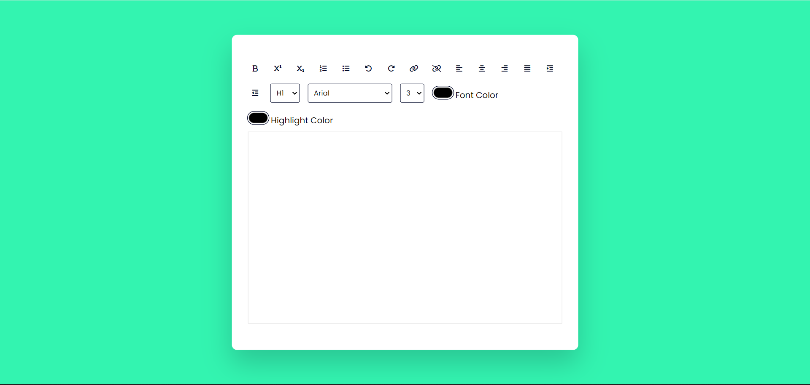

# Text-Editor

A simple text editor created using HTML, CSS, and JavaScript. This editor allows you to perform various text formatting and styling operations.

## Features

### Formatting Options
- **Bold Text**: Click the **B** button to make the selected text bold.
- **Superscript Text**:You can also write in Superscript format.
- **Subscript Text**: You can also write in Subscript format.

### Lists
- **Ordered List**: Create numbered lists by clicking the numbered list button.
- **Unordered List**: Create bulleted lists with the bullet list button.

### Undo and Redo
- **Undo**: Reverse your last action using the undo button.
- **Redo**: Restore your undone action with the redo button.

### Hyperlinks
- **Create Link**: Highlight text and click the link button to insert or edit a hyperlink.
- **Remove Link**: Remove an existing hyperlink by selecting text and clicking the unlink button.

### Alignment
- **Left Align**: Align text to the left with the align-left button.
- **Center Align**: Center-align text using the align-center button.
- **Right Align**: Right-align text with the align-right button.
- **Justify**: Fully justify text with the align-justify button.

### Spacing
- **Indent**: Increase the indentation of text using the indent button.
- **Outdent**: Decrease the indentation of text with the outdent button.

### Advanced Formatting
- **Heading Size**: Choose the heading size from the dropdown menu.
- **Font Family**: Select the font family from the dropdown menu.
- **Font Size**: Choose the font size from the dropdown menu.
- **Font Color**: Pick a font color using the color input.
- **Highlight Color**: Choose a highlight color using the color input.
## Implementation Examples

